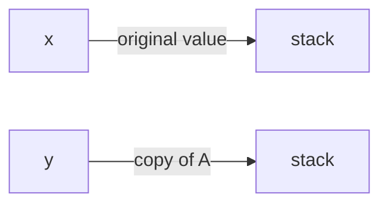
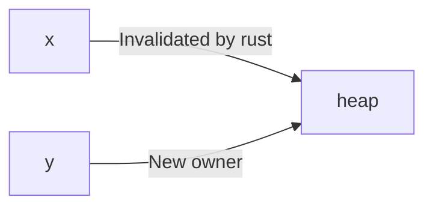
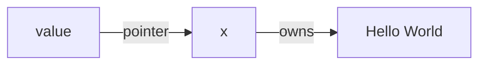

With C you are able to set pointers and reference them at will. The caveat being that C will not guarantee if your pointer will be referencing a valid memory address. Given the user has so much control over memory addresses, it also allows for bugs to creep into code. Pointers don't keep track of the validity of underlying values and it's totally possible to accidentally set a pointer pointing to null. 

Rust circumvents the pointer issue by using its own system of memory management. A reference in rust is similar to C in that it acts like a pointer to data behind a memory address. However, it is guaranteed that the reference will point to valid data. 

## Overview
### Rules of Rust Ownership
1. Each value has a variable that is its owner
2. There can only be one owner at a time
3. When an owner is out of scope, the value is dropped

### Primitives
In the case of primitives like `u32`, `i32`, or `bool` they implement the `Copy` trait. This allows rust to create a copy of the value since it's all stored on the stack. 

```rust
fn main() {
    let x: u32 = 10;
    let y = x;
    
    println!(x); // valid print of x's value
}
```

`y` is a deep copy of `x` so there are no ownership issues here



### Moving
When you have multiple variables reference values on the heap, rust will complain. 

Given the following example, 

```rust
fn main() {
    let x: String = String::from("Hello World");
    let y = x;

    println!(x);
}
```
You will get a move error on compile.


Unlike C where two pointers to the same heap location may conflict, by enforcing ownership of only one variable at a time, rust guarantees you won't run into situations where one pointer modifies an underlying value without the other one knowing. 

## Functions
Passing variables into a function is similar to assigning values to new variables.

### What can go wrong?
```rust
fn ownership_func(value: String) {
    ...
}

fn main() {
    let x: String = String::from("Hello World");
    ownership_func(x);
    println!(x);
}
```
When we call `ownership_func` with `x`, we move the ownership of `x` into the function. However, when the function completes, the value of x gets dropped. There is now a dangling reference in main to a value `x` that was already dropped.

### Returning ownership
You can have a function return ownership of a value back to the original variable to bypass the move compiler error. 
```rust
fn ownership_func(value: String) -> String {
    ...
    value
}

fn main() {
    let x: String = String::from("Hello World");
    x = ownership_func(x);
    println!(x);
}
``` 

### References and Borrowing
You can use the idea of references and borrowing to simplify process of transferring ownership repeatedly between values and functions. 

> **Reference**: a pointer (immutable)
> **Borrowing**: passing in a reference without transferring ownership. You cannot modify a value that is borrowed. 

```rust 
fn borrower(value: &String) -> u32 {
    value.len();
}  

fn main() {
    let x: String = String::from("Hello World");
    let size: u32 = borrower(x);
    println("{}, {}", x, size);
}
```

`value` is a pointer that refers to the value of x. 



## Mutability
What if you want to modify a value without transferring ownership?

You can use mutable references!

```rust
fn mutate(value: &mut String) {
    value.push_str("!");
}

fn main() {
    let mut x: String = String::from("Hello World");
    mutate(x);
    println!(x); // prints "Hello World!"
}
```

### Mutability Restrictions
1. For a given scope, there can only be one mutable reference
2. If an immutable reference already exists in scope, you cannot have a mutable reference

## Reference Syntax
:warning: ... section in progress

Similar to C, rust also uses the same symbols for reference/pointer manipulation. 

=== "Rust"

    ```rust
    fn main() {
        let x: u32 = 10; # initialize a variable with value 10

        let y = x; # y creates a full copy of x since the u32 type has the Copy trait
    }
    ```

=== "C"

    ```c
    int main(void) {
        int x = 10; # initialize a variable with value 10

        int* y = &x # initialize a pointer that references the address of a value

        *x = 20; # dereference pointer and set new value at pointer location
    }
    ```

## References
* [Rust docs](https://doc.rust-lang.org/std/primitive.pointer.html)
* [Let's Get Rusty Youtube Video - Ownership](https://www.youtube.com/watch?v=VFIOSWy93H0)


